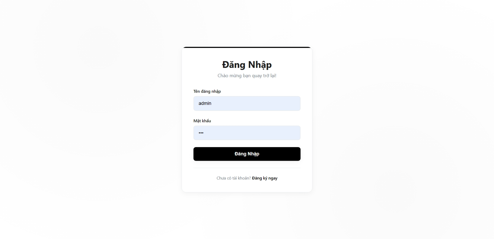
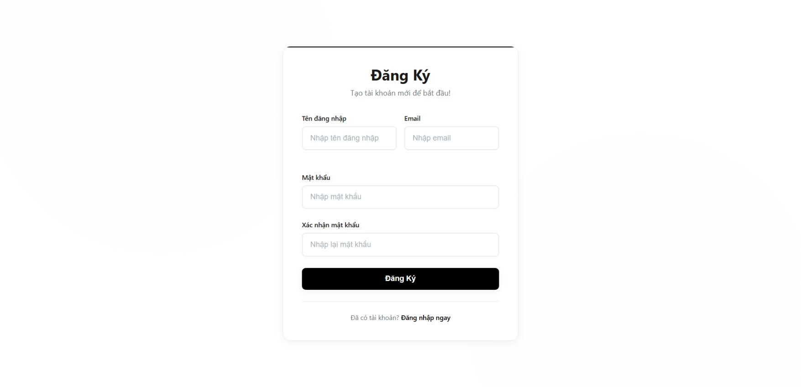
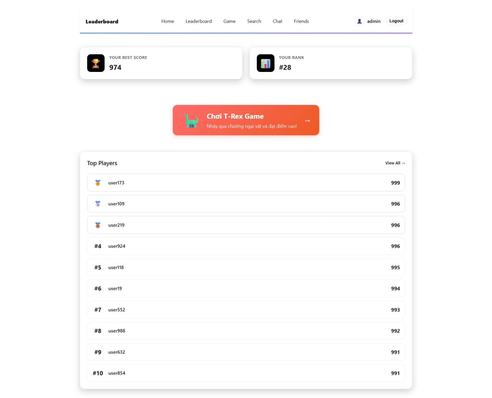
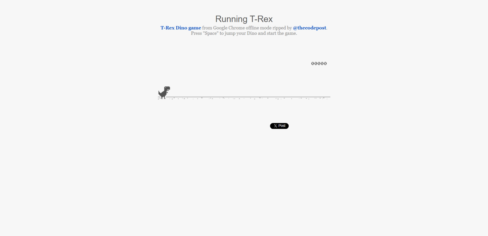
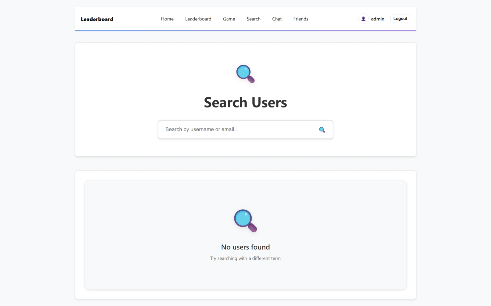
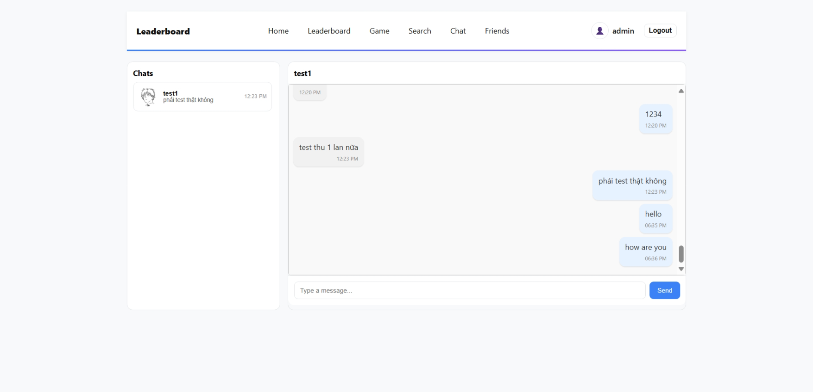
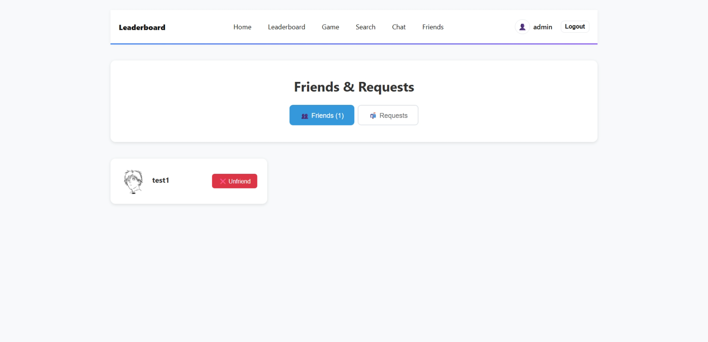
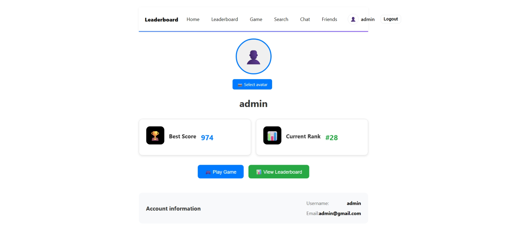

# Real-time Leaderboard

Hệ thống bảng xếp hạng thời gian thực, cho phép người dùng chơi game, cạnh tranh điểm số và theo dõi bảng xếp hạng trực tiếp.

## Chức năng chính

- Đăng ký và đăng nhập: với hệ thống xác thực JWT an toàn
- Game T-Rex: tích hợp sẵn và ghi điểm số
- Xem bảng xếp hạng thời gian thực: cập nhật real time qua SignalR

## Quick Start

#### 1. Chuẩn bị Database

- Tạo database SQL Server (ví dụ: RealTimeLeaderboard)
- Cập nhật connection string trong API/appsettings.json

#### 2. Chạy Backend API

- cd API
- dotnet restore
- dotnet run

#### 3. Chạy Frontend

- cd UI
- npm install
- npm start

## Demo

