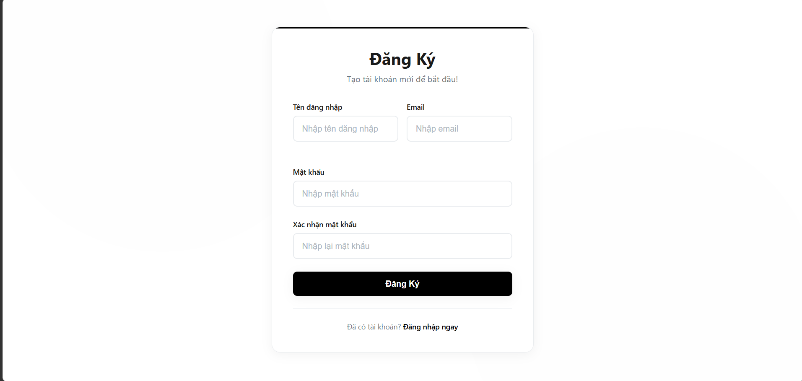
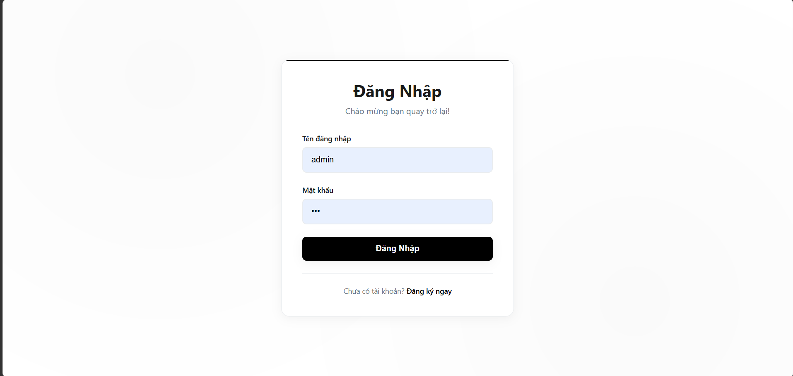
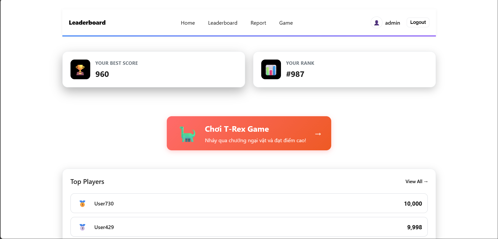
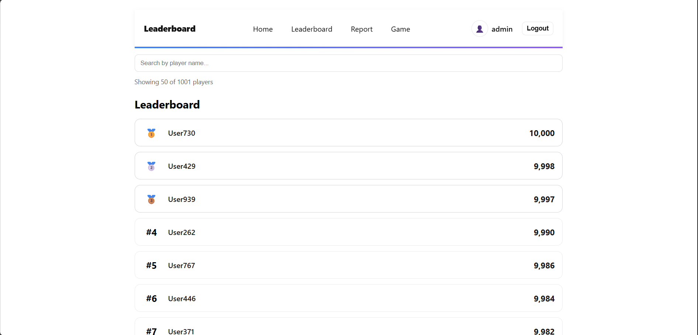
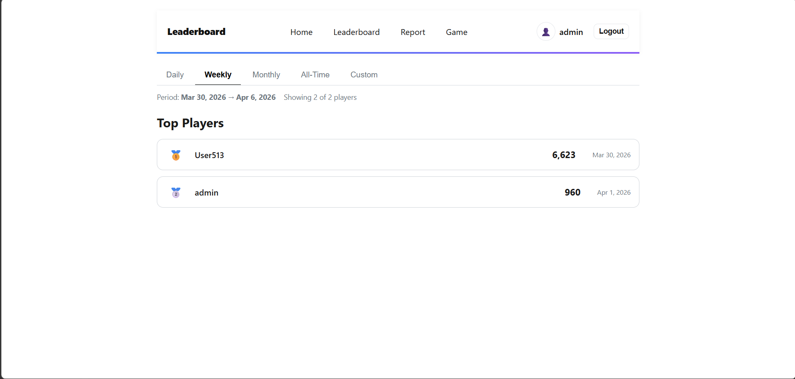
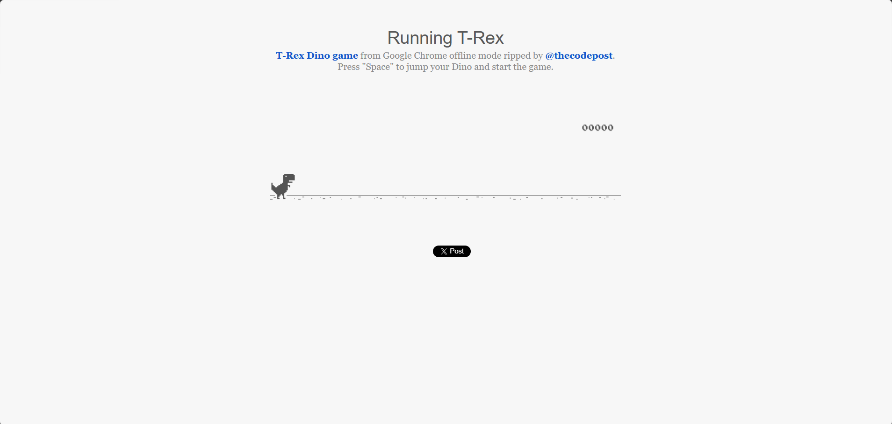

# Bảng xếp hạng thời gian thực

## Giới thiệu

Bảng xếp hạng thời gian thực là một nền tảng quản lý bảng xếp hạng cho trò chơi web T-Rex, cho phép người chơi đăng ký, đăng nhập, chơi và xem điểm của mình cũng như của người khác.

---

## Tính năng nổi bật

**Xác thực an toàn**

- Xác thực dựa trên token JWT
- Hash mật khẩu bằng BCrypt
- CORS cấu hình cho frontend React

**Bảng xếp hạng thời gian thực**

- Sử dụng Redis sorted set với độ phức tạp O(log N)
- Hỗ trợ phân trang (skip/take)
- Tự động đồng bộ SQL → Redis khi khởi động

**Tích hợp trò chơi T-Rex**

- Game T-Rex được tích hợp sẵn
- Gửi điểm tự động sau khi kết thúc

**Giao diện người dùng**

- Frontend React 19
- Sử dụng Material-UI
- Responsive và thân thiện với thiết bị di động

**Đóng gói bằng Docker & Sẵn sàng triển khai**

- Set up nhanh chóng với Docker Compose
- Health checks cho tất cả các dịch vụ
- Tự động chạy migration và seeding cơ sở dữ liệu

---

## Hướng dẫn cài đặt

### Yêu cầu hệ thống

- Docker ≥ 20.10 & Docker Compose ≥ 1.29+
  - [Cài Docker Desktop](https://www.docker.com/products/docker-desktop)
- Git (để clone repository)

### Bước 1: Clone & Chuẩn bị

```bash
git clone https://github.com/yourusername/Real-time-Leaderboard.git
```

### Bước 2: Khởi chạy với Docker Compose

Từ thư mục gốc `Real-time-Leaderboard` (chứa `docker-compose.yml`), chạy:

```bash
docker compose up --build
```

Lần đầu sẽ tốn thời gian (pull images, build, restore NuGet packages, npm install, v.v.)

### Bước 3: Truy cập ứng dụng

- Giao diện: http://localhost:3000

## Demo

Dưới đây là một số ảnh chụp màn hình demo của ứng dụng (thư mục `DemoPhoto`):












