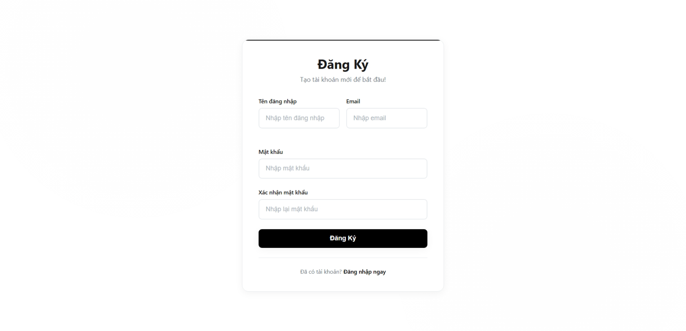
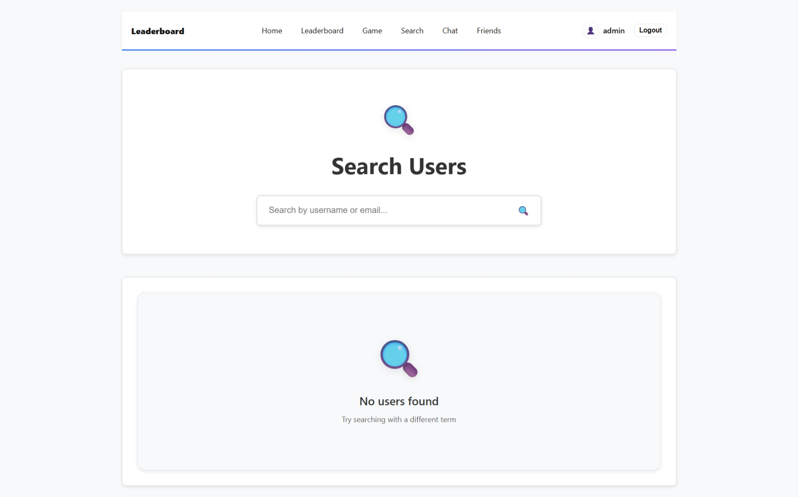

# Real-time Leaderboard

Hệ thống bảng xếp hạng thời gian thực, cho phép người dùng chơi game, cạnh tranh điểm số và theo dõi bảng xếp hạng trực tiếp, kết hợp với các chức năng cơ bản của mạng xã hội.

## Chức năng chính

- Đăng ký và đăng nhập: với hệ thống xác thực JWT an toàn
- Game T-Rex: tích hợp sẵn và ghi điểm số
- Xem bảng xếp hạng thời gian thực: cập nhật real time qua SignalR
- Tương tác xã hội: với hệ thống bạn bè và chat trực tiếp
- Tìm kiếm người chơi: và xem thông tin chi tiết
- Trang cá nhân: hiển thị thông tin người dùng và chỉnh sửa thông tin cơ bản

## Quick Start

#### 1. Chuẩn bị Database

- Tạo database SQL Server (ví dụ: RealTimeLeaderboard)
- Cập nhật connection string trong API/appsettings.json

#### 2. Chạy Backend API

- cd API
- dotnet restore
- dotnet run

#### 3. Chạy Frontend

- cd UI
- npm install
- npm start

## Demo

